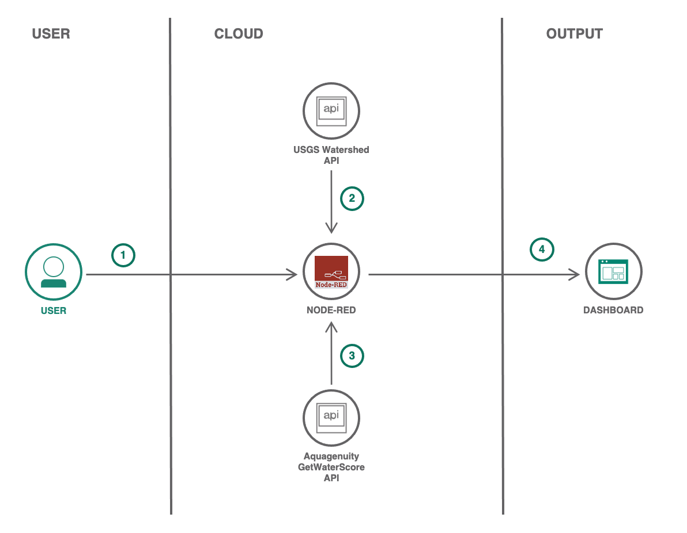
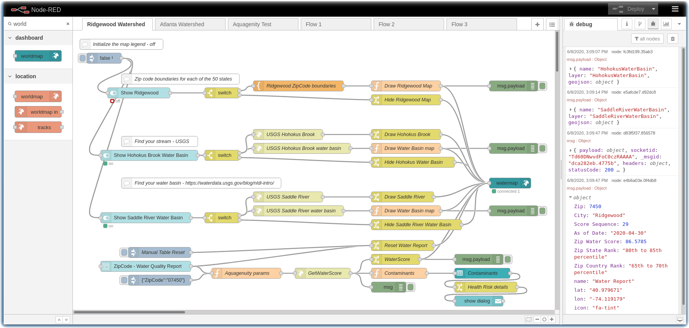
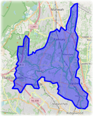
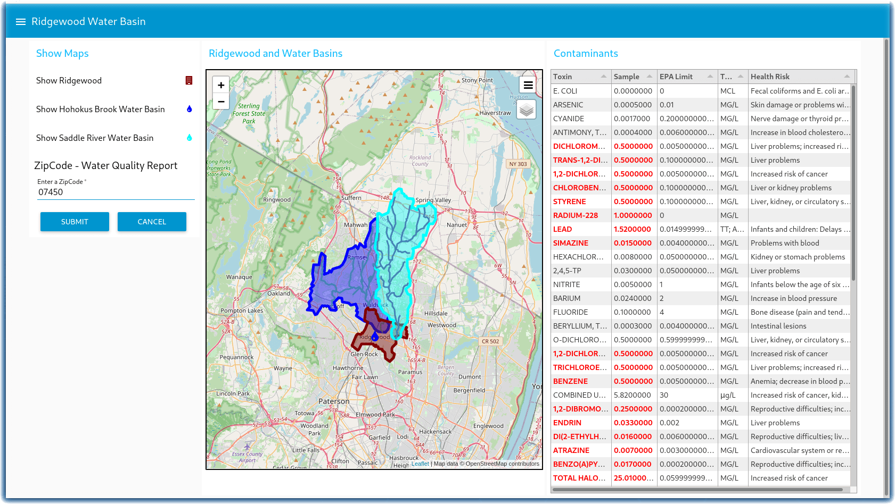

# Clean water and sanitation - Build a flow that displays the Ridgewood NJ watershed on a map

## Workshop Resources

- Login/Sign Up for IBM Cloud: https://ibm.biz/NodeRedCleanWater

- Hands-On Guide: https://ibm.biz/NRCleanWater-Guide

- Slides: https://fawazsiddiqi.github.io/CFC-Water-Ridgewood

- Workshop Replay: https://www.crowdcast.io/e/water-quality/

## What is the problem?

Water is the natural resource that is most threatened by climate change and is a prerequisite for life on earth. According to the World Health Organization, 2.2 billion people around the world do not have safely managed drinking water services, 4.2 billion people do not have safely managed sanitation services, and 3 billion people lack basic handwashing facilities. These services are critical in preventing the spread of COVID-19 and other diseases. Even in areas that have these services, there are vast inequalities in the accessibility, availability, and quality of the services. 

## Video by our Call for Code Partner [charity: water](https://www.charitywater.org) - The Spring - The charity: water story

[](https://www.youtube.com/watch?v=UE9UvT5ujyg)

## How can technology solve the problem?

From intelligent solutions for small farmers to recycling showers, technology can make a significant impact on the availability of water and its consumption.

## The idea

To encourage optimal water choices by consumers and local governments and to incentivize water sustainability, we propose devising and implementing an API for water data collection and dissemination. With an API, you could have a centralized way to:

- Query geolocations of sustainable water sources
- Simplify coordination and funding for water construction projects
- Explore educational tools to support water sustainability and clean water access
- Enable transparent water usage, cleanliness results, and site-to-site comparison
- Access plain language case studies and legislation

We are initially focusing on the development of a starter kit that will enable these channels to be developed to their fullest potential.

Explore more ideas [here](https://github.com/Call-for-Code/Solution-Starter-Kit-Water-2021#solution-ideas)

## Architecture



## Tutorial 

This tutorial is part of the [2021 Call for Code Global Challenge](https://developer.ibm.com/callforcode/).

The example Node-RED flows and dashboards can help you build a water quality dashboard using GeoJSON. After completing this tutorial, you will be ready to modify these example flows and dashboards to create your own map and data visualization solution.

The Node-RED flows in this tutorial demonstrate how to display US Geological Survey (USGS) watershed maps on a Node-RED dashboard. Several examples describe how to query the watershed area maps of [Ridgewood, NJ](https://waterdata.usgs.gov/monitoring-location/01390500/#parameterCode=00060)
and [Atlanta, GA](https://www.atlantawatershed.org/) using the
[USGS Hydro Network-Linked Data Index](https://waterdata.usgs.gov/blog/nldi-intro/),
and then plot the water basins and rivers on a [Node-RED](https://nodered.org) dashboard.

The USGS [NLDI API](https://labs.waterdata.usgs.gov/api/nldi/swagger-ui.html) returns a [GeoJSON](https://en.wikipedia.org/wiki/GeoJSON) set of latitude / longitude coordinates and features that can be plotted using the `node-red-contrib-web-worldmap` node. To generate your own map, visit [http://geojson.io](http://geojson.io) which allows you to quickly generate a `geojson` file.

Water sustainability requires protecting the groundwater and sub-surface aquifer from dangerous / toxic pollutants. [Aquagenuity](https://aquagenuity.com/) helps everyday people monitor water quality in their community. The [Aquagenuity Developer API](https://aquagenuity.com/developer) provides water quality reports for many USA ZipCodes.

The following figure shows the Ridgewood NJ watershed dashboard:



## Learning objectives

In this tutorial, you will:

* Install Node-RED and the prerequisites required to build the dashboards
* Learn about GeoJSON
* Learn how to query the US Geological Survey Watershed API
* Integrate water quality reports into an application
* Build a dashboard that displays GeoJSON area maps and pins

## Prerequisites

<sidebar>**[Node-RED Essentials](https://developer.ibm.com/videos/node-red-essentials/)** <p>Use the videos in this playlist to help you learn the basics of building Node-RED flows.</p></sidebar>

* Login/Sign Up for IBM Cloud [here](https://developer.ibm.com/dwwi/jsp/register.jsp?eventid=cfc2021challenge&utm_medium=Inpersondirected&utm_content=000039JL&utm_term=10008917&utm_id=May2021-callforcodebuildawaterqualitydashboardwithgeojsonandnode-red-eventid-606ebc8ea197ff40e061baee-global-devadvgrp-dubai-hybrid-workshop-dubai-cfc2021challenge)
* [Install Node-RED](https://nodered.org/docs/getting-started/) on your system or in IBM Cloud. You can create and deploy these flows and dashboards to [IBM Cloud](https://developer.ibm.com/dwwi/jsp/register.jsp?eventid=cfc2021challenge&utm_medium=Inpersondirected&utm_content=000039JL&utm_term=10008917&utm_id=May2021-callforcodebuildawaterqualitydashboardwithgeojsonandnode-red-eventid-606ebc8ea197ff40e061baee-global-devadvgrp-dubai-hybrid-workshop-dubai-cfc2021challenge) by [creating a Node-RED Starter application](/tutorials/how-to-create-a-node-red-starter-application/).

* [Add the following nodes](https://nodered.org/docs/user-guide/runtime/adding-nodes) to your Node-RED palette:

    * [node-red-dashboard](https://flows.nodered.org/node/node-red-dashboard)
    * [node-red-contrib-web-worldmap](https://flows.nodered.org/node/node-red-contrib-web-worldmap)
    * [node-red-node-ui-table](https://flows.nodered.org/node/node-red-node-ui-table)

* Sign up for a free [Aquagenuity Developer](https://aquagenuity.com/developer) API key

## Estimated time

Completing this tutorial should take about 30 minutes.

## Steps

* [Learn about GeoJSON](#learn-about-geojson)
* [Learn how to query the USGS Watershed API](#learn-how-to-query-the-usgs-watershed-api)
* [Query the Aquagenuity GetWaterScore API](#query-the-aquagenuity-getwaterscore-api)
* [Example 1: Build a flow that displays the Ridgewood NJ watershed on a map](#example-1-build-a-flow-that-displays-the-ridgewood-nj-watershed-on-a-map)
* [Example 2: Build a flow that displays the Atlanta GA watershed on a map](#example-2-build-a-flow-that-displays-the-atlanta-ga-watershed-on-a-map)

### Learn about GeoJSON

[GeoJSON](https://en.wikipedia.org/wiki/GeoJSON) is a format for encoding a variety of geographic data structures. It is based on the JSON format. GeoJSON supports the following geometry types: Point, LineString, Polygon, MultiPoint, MultiLineString, and MultiPolygon. Geometric objects with additional properties are `Feature` objects. Sets of features are contained by `FeatureCollection` objects.

```
{
  "type": "Feature",
  "geometry": {
    "type": "Point",
    "coordinates": [58,24]
  },
  "properties": {
    "name": "Elbonia"
  }
}
```

The GeoJSON format can define a polygon which will render an area map of a town, county, or state, for example. Amongst its many uses, it can define the topographical boundary of a watershed.

### Learn how to query the USGS Watershed API

The USGS [NLDI API](https://labs.waterdata.usgs.gov/api/nldi/swagger-ui.html) returns a GeoJSON set of latitude / longitude coordinates and features that can be plotted on a map. You can [search for a river](https://waterdata.usgs.gov/nwis/inventory?state_cd=nj&format=station_list) near you. The drainage basin is an area of land where surface water runs off and converges into streams, rivers, lakes, and oceans. Using the GeoJSON information to observe where water sources are located, and what contaminants might be upstream, can lead to better water management and quality.

The NLDI API is provided by the [Open Water Data Initiative](https://acwi.gov/spatial/owdi/) and is being developed as an [open source project](https://github.com/ACWI-SSWD).

Here is an example which calls the USGS NLDI API to retrieve a GeoJSON object for the watershed basin for the Hohokus Brook upstream of Ridgewood, NJ.

```
curl https://labs.waterdata.usgs.gov/api/nldi/linked-data/nwissite/USGS-01391000/basin
```

If you were to plot the GeoJSON on a map with some fill properties, the map draws an area boundary.

<center></center>

### Query the Aquagenuity GetWaterScore API

The Aquagenuity GetWaterScore API provides water quality reports for many USA ZipCodes. Sign up for a free [Aquagenuity Developer](https://aquagenuity.com/developer) API key. Select the free plan and create an account. You will receive an email welcoming you to the Aquagenuity Developer Access Program. The email will contain your username and password credentials.

Review the [GetWaterScore api documentation](https://aquagenuity.com/api) to learn how to query water quality reports.

```
# Example Zipcode value of (07450)

curl --header "Content-Type: application/json" \
--request POST \
--data '{"auth":{"username":"XXXXXXXXX","password":"XXXXXXXXXX"},"zipcode":"07450"}' \
https://aquagenuity.com/GetWaterScore
```

The `GetWaterScore` API replies with a json object and array of contaminants in the water for that Zip Code. It also includes the EPA toxin limits and health risks of the toxins. Note the units of the returned values. If you have any questions about the API, [contact Aquagenuity](mailto:hello@aquagenuity.com).

For this tutorial, the chemical toxins found in the water are displayed in a Node-RED table. If the toxins exceed the EPA limits, the table highlights the chemical in red and, when selected, will popup an informational dialog about the health risks of that toxin. USGS also publishes [Water Quality Data](https://www.waterqualitydata.us/portal/)

## Final Output 



## Workshop Resources

- Login/Sign Up for IBM Cloud: https://ibm.biz/NodeRedCleanWater

- Hands-On Guide: https://ibm.biz/NRCleanWater-Guide

- Slides: https://fawazsiddiqi.github.io/CFC-Water-Ridgewood

- Workshop Replay: https://www.crowdcast.io/e/water-quality/